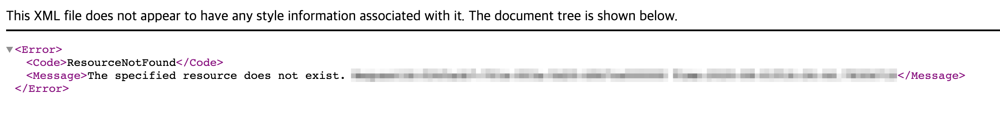
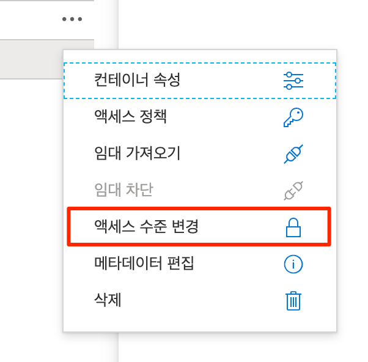
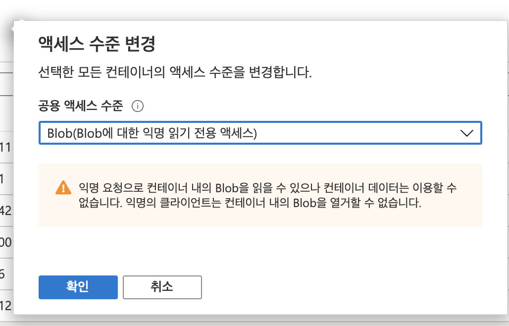

# Rasberry-pi camera server

## Using camera module in Rasberrypi
```
raspistill -o image.jpg
```

## Prerequisites 
- Python 3.7
- Azure account 

### Azure settings

You need to insert your own storage name, connection string, and container name in `storage.py` 
```py
AZURE_STORAGE_NAME = ""
AZURE_STORAGE_CONNECTION_STRING = ""
CONTAINER_NAME = ""
```

## Install and Run
```
$ pip install -r requirements.txt && ./run.sh
```
and go to [localhost:5000](http://localhost:5000)

- more details on [here](https://docs.microsoft.com/ko-kr/azure/storage/blobs/storage-quickstart-blobs-python#upload-blobs-to-a-container)

### Troubleshooting
- 404 on blob url 

  - Portal > Blob service > Container > Access Policy Level > set as **blob**
  
  
